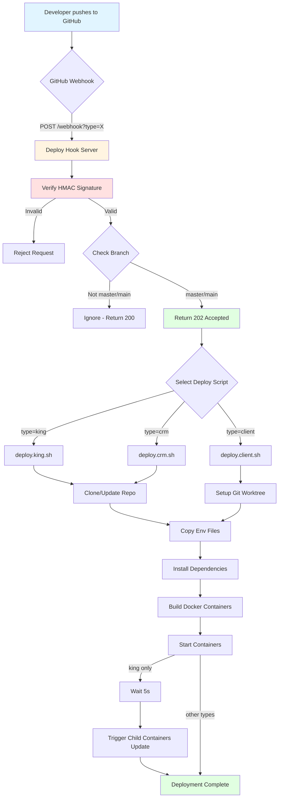

# Deployer

Automated deployments via secure webhooks. This tiny Node.js service listens for GitHub webhooks (or your own signed HTTP calls) and runs project-specific deployment scripts that build and run Docker containers on your server.

— Keep your server always up-to-date after pushes to the main branch — or trigger a manual deploy from any app.

## Highlights
- Secure HMAC SHA256 signature verification (`X-Hub-Signature-256`)
- One endpoint for multiple deployment targets
- Works with GitHub Webhooks and manual HTTP calls
- Ships as Node app, with PM2 and Docker options
- Branch filtering (only deploys from `master`/`main` branches)
- Automatic child container updates for `king` deployments
- Multi-tenant support via git worktree for `client` type

## How it works
- The server exposes `POST /webhook?type=<king|client|crm>`.
- The request body (raw JSON) is verified with HMAC SHA256 using your `SECRET`.
- Branch validation: only `master`/`main` branches trigger deployments (except `client` which uses `payload.gitBranch`).
- Server responds with `202 Accepted` immediately (async deployment).
- Based on `type`, one of the scripts in `shared/` is executed:
  - `type=king` → `shared/deploy.king.sh` (production)
  - `type=client` → `shared/deploy.client.sh` (uses git worktree for multi-tenant)
  - `type=crm` → `shared/deploy.crm.sh` (production)
- Scripts clone/update the corresponding repos via SSH, apply env files from `shared/envs/**`, then build and run containers via each project’s own scripts.

## Project layout
- `index.js` — Express server, signature verification, branch filtering, and script runner
- `shared/` — deployment scripts, SSL bundle, environment templates (`envs/`)
- `repos/` — working directory where target projects are cloned/updated
- `worktrees/` — git worktrees for multi-tenant `client` deployments (one per domain)
- `ecosystem.config.js` — PM2 configuration
- `docker-compose.yaml`, `Dockerfile` — containerization for this service

## Requirements
- Node.js 18+ (Docker image uses `node:22-alpine`)
- Docker + Docker Compose
- Git with SSH access to target repos (configure `~/.ssh/config` and keys; scripts use SSH host aliases like `git@github-king-of-pos:...`, `git@github-gdmn-nxt:...`)
- `pnpm` and `yarn` installed on the server (used by target projects)

## Environment (.env)
Create a `.env` in the project root (use `.env.sample` as a reference):

```env
SECRET=your_hmac_secret
PORT=60112

# Optional defaults for deployments that provide no explicit ports/hosts
MAIN_CONTAINER_PORT=3000
MAIN_DB_PORT=27017
MAIN_DB_HOST=93.84.115.54

# PM2 Enterprise keys (optional, used for 'king' type deployments)
IN_PM2_PUBLIC_KEY=your_pm2_public_key
IN_PM2_SECRET_KEY=your_pm2_secret_key
```

Notes:
- `SECRET` is required; requests with invalid or missing signatures are rejected.
- `PORT` is where this service listens (`0.0.0.0:<PORT>`).
- For `king`/`client` you may send `env.domain`, `env.port`, `env.dbPort`, `env.dbHost` in the body; otherwise `MAIN_CONTAINER_PORT`/`MAIN_DB_PORT`/`MAIN_DB_HOST` are used.
- `MAIN_DB_HOST` defaults to `93.84.115.54` if not set.

## Run it

### Node (local)
```bash
npm install
npm start
# or
node index.js
```

### PM2
```bash
npm install --production
pm2 start
# or
pm2 start ecosystem.config.js
```
`run_server.sh` simply calls `pm2 start` (and includes optional PM2 Enterprise variables).

### Docker
1) Build and run:
```bash
docker compose up -d --build
```
Ensure `PORT` in `.env` matches the exposed mapping (`${PORT}:${PORT}`).

2) Update/restart:
```bash
docker compose pull
docker compose up -d
```

## Webhook endpoint

- Method: `POST`
- URL: `/webhook?type=<king|client|crm>`
- Headers: `X-Hub-Signature-256: sha256=<hex>`
- Body: JSON; may contain `env` for domain/ports (used by `king`/`client`)

Example body (GitHub webhook):
```json
{
  "ref": "refs/heads/master",
  "env": {
    "domain": "my-tenant",
    "port": 3001,
    "dbPort": 27018,
    "dbHost": "93.84.115.54"
  }
}
```

Example body (for `client` type with custom branch):
```json
{
  "gitBranch": "master",
  "env": {
    "domain": "my-tenant"
  }
}
```

What happens:
1. The server reads the raw JSON to compute HMAC accurately.
2. Compares `X-Hub-Signature-256` to `sha256=<hex(HMAC_SHA256(SECRET, rawBody))>`.
3. **Branch validation**: 
   - For `king`/`crm`: checks `payload.ref` must be `refs/heads/master` or `refs/heads/main`
   - For `client`: checks `payload.gitBranch` must be `master` or `main`
   - If branch doesn't match, returns `200 OK` with `{ ignored: true }` and stops
4. Returns `202 Accepted` immediately (deployment runs asynchronously).
5. Selects and runs the script for the given `type`.
6. For `king`/`client`, environment variables derived from `env.domain` are exported (e.g., `CONTAINER_NAME`, `DB_CONTAINER_NAME`, `NEXTAUTH_URL`, `DB_HOST`, `DB_PORT`, etc.).
7. For `king` type: after successful deployment, waits 5 seconds and triggers child container updates via `https://king-pos.gdmn.app/api/deploy/webhook`.

If `type` is missing or unknown → `"Unrecognised repository webhook"`.

## Manual trigger (curl)
You must sign the body exactly like GitHub:
`signature = 'sha256=' + hex( HMAC_SHA256(SECRET, rawBody) )`

```bash
BODY='{"ref":"refs/heads/master","env":{"domain":"my-tenant","port":3001,"dbPort":27018}}'
SIGNATURE="sha256=$(printf '%s' "$BODY" | openssl dgst -sha256 -hmac "$SECRET" -binary | xxd -p -c 256)"

curl -X POST "http://<host>:<PORT>/webhook?type=king" \
  -H "Content-Type: application/json" \
  -H "X-Hub-Signature-256: $SIGNATURE" \
  --data "$BODY"
```

Immediate response (202 Accepted):
```json
{ "received": true }
```

Note: The deployment runs asynchronously. Check server logs for completion status. The server doesn't wait for deployment to finish before responding.

## GitHub Webhook setup
- URL: `http(s)://<host>:<PORT>/webhook?type=<king|client|crm>`
- Content type: `application/json`
- Secret: your `.env` `SECRET`
- Events: at minimum, `push` on the main branch of the corresponding repo

GitHub will sign each request with `X-Hub-Signature-256`, which this service verifies.

**Important**: The service filters branches automatically — only `master`/`main` branch pushes trigger deployments. Pushes to other branches are ignored with a `200 OK` response.

## Deployment scripts (shared/*.sh)

### `shared/deploy.king.sh`
- **Project**: King POS (production)
- **Branch**: `master`
- **Package manager**: `pnpm`
- **Environment**: Uses `shared/envs/king-pos/.env.prod.local`
- **Special**: Sets `IS_CENTRAL_DB=true`, `PM2_PUBLIC_KEY`, `PM2_SECRET_KEY` env vars
- **Post-deploy**: Triggers child container updates at `https://king-pos.gdmn.app/api/deploy/webhook`

### `shared/deploy.king.test.sh`
- **Project**: King POS (test environment)
- **Port**: Fixed to `61081` (overrides `env.port`)
- **Other**: Same as `deploy.king.sh` but for testing

### `shared/deploy.client.sh`
- **Project**: King POS client (multi-tenant)
- **Branch**: `master` (merged into client-specific branches)
- **Package manager**: `pnpm`
- **Environment**: Uses `shared/envs/king-pos/.env.prod.local`
- **Special**: Uses **git worktree** for multi-tenant deployments
  - Base repo cloned to `repos/king-pos-server`
  - Each domain gets its own worktree in `worktrees/<domain>`
  - Creates branch `king-client-<domain>` if it doesn't exist
  - Merges `master` into client branch before deploying
- **Deployments**: Runs both DB (`docker:db:up`) and UI (`docker:s:up`) containers

### `shared/deploy.crm.sh`
- **Project**: CRM (production)
- **Branch**: `main`
- **Package manager**: `yarn`
- **Environment**: Copies all files from `shared/envs/crm/` to project root

### `shared/deploy.crm.test.sh`
- **Project**: CRM (test environment)
- **Other**: Same as `deploy.crm.sh` but for testing

**Important notes:**
- Scripts use SSH host aliases (`git@github-king-of-pos:...`, `git@github-gdmn-nxt:...`), so ensure SSH keys and `~/.ssh/config` are configured on the server.
- `SSL_CERT_PATH` is exported pointing to `shared/ssl` and consumed by target projects.
- Target projects control their own docker-compose; these scripts orchestrate them.
- All scripts perform `git reset --hard` and `git clean -fd` before pulling to ensure clean state.

## CI/CD Pipeline Flow



## Troubleshooting
- **401 or invalid signature**: wrong `SECRET` or signature computed against a modified body (must use raw JSON).
- **Branch ignored**: check that you're pushing to `master`/`main` branch (or `payload.gitBranch` for `client` type).
- **Repo access failures**: check SSH keys and host aliases in `~/.ssh/config` (aliases like `github-king-of-pos`, `github-gdmn-nxt`).
- **Port conflicts**: adjust `env.port`/`env.dbPort` or the defaults `MAIN_CONTAINER_PORT`/`MAIN_DB_PORT`.
- **Worktree errors** (`client` type): ensure `worktrees/` directory is writable and git worktree commands have proper permissions.
- **Child containers not updating** (`king` type): check that `https://king-pos.gdmn.app/api/deploy/webhook` is accessible and accepts the forwarded webhook.

## License
MIT
